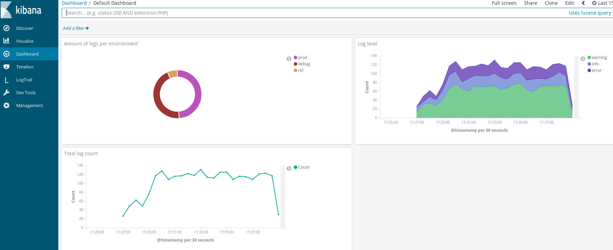

# Erlang Logging to kibana
Demonstration of how to setup Elastic Search, Kibana, Logstash and
Logtrail, with Erlang lager. Please read about the [ELK Stack]
about what all those tools are about.

### sample default dashboard

### sample logtrail output
See the [Logtrail Plugin Repository].

## Configure erlang
You need to configure the following [rebar3] files:

- `rebar.config`: Add our custom [custom lager-logstash backend], it's
  custom because the original one had problems handling UTC and we need
  to add support for environment variables.
~~~
{deps, [
        lager,
        {lager_logstash_backend,
         {git,"https://github.com/lambdaclass/lager_logstash_backend",
          {tag, "0.1"}}}
]}
~~~

- `conf/sys.config`(`sasl`): UTC should be explicitly configured
  `{sasl, [{utc_log, true}]}`, is enough to force lager to use UTC.

- `conf/sys.config`(`lager_logstash_backend`): adds the configuration
  needed by the backend to communicate with logstash, and some
  additional data

~~~
{lager_logstash_backend,
      [
       {level,         info},
       {logstash_host, "127.0.0.1"},
       {logstash_port, 9125},
       {node_role,     "erlang"},
       {node_version,  "0.0.1"},
       {metadata, [
                   {account_token,  [{encoding, string}]},
                   {client_os,      [{encoding, string}]},
                   {client_version, [{encoding, string}]}
                  ]}
      ]}
~~~

- `app.src`, don't forget to add `lager`, `jiffy`, and
  `lager_logstash_backend` to the applications.

- `ENV` environment variable need to be set because is sent by the
  backend directly to logstash, if isn't set the default value
  will be `debug`.

## ops
There is two cases contemplated, the first when you want to check
that ELK is working locally for development, and then when you want
to deploy to production. For more information please refer to
[OPS](ops/).

## testing
Once you have ensured you have [docker] and [docker-compose] installed,
start the test/development environment with:

- `make ops` starts every service and initializes kibana.
- `make test-env1` and `make test-env2` starts an erlang application that
  generates random logs. The two functions do the same, but with
  different `ENV` environment variable definitions.

You can see the logged data at `http://localhost:5601/`. But if you see
any error at Kibana please be sure that there is actually logs to show,
for that reason you need to run `make test-env[1|2]`.

Another consideration is that when developing locally via `make ops`
and script is running in the background waiting for Kibana to be
ready and push the default configuration, for that reason you may see
some `curl` errors while the services are not fully working.

[ELK Stack]: https://www.elastic.co/elk-stack
[Logtrail Plugin Repository]: https://github.com/sivasamyk/logtrail
[rebar3]: https://github.com/erlang/rebar3
[custom lager-logstash backend]: https://github.com/lambdaclass/lager_logstash_backend
[docker]: https://docs.docker.com/install/
[docker-compose]: https://docs.docker.com/compose/install/
